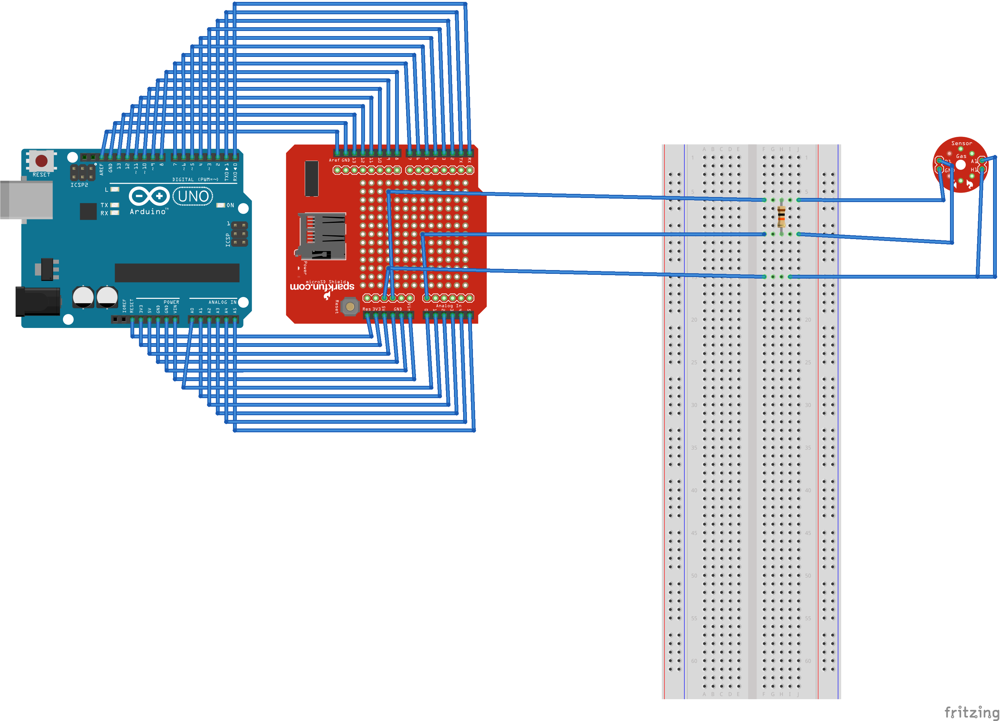

# Saturday-Six-Hour-Challenge_MQ-2
MQ-2 Smoke/LPG/CO Gas Sensor

## Description:
The MQ-2 is a sensor that can detect smoke,co,lpg levels. You can connect your arduino with a computer and check the values from the serial port.

## Tools needed:
- 1 x Arduino UNO
- 1 x Breadboard 
- 1 x MQ-2 Sensor
- 1 x USB cable
- 1 x Connector (5 pins)
- 1 x Resistor 10KOhm

## Installation: 
- Download the code.
- Open the Arduino IDE and load the code.
- Open the serial port monitor
(Optional) You can download Fritzing from http://fritzing.org/download/ to view the schematics

## Usage:
- You can open the MQ-2_sensor.fzz with Fritzing

## Schematic:

